# Room API 第一版业务流程

## 1. 发送注册邮箱验证码

触发：

用户在注册页填写邮箱后点击获取验证码。

前置条件：

- 邮箱格式正确
- 邮箱未被注册
- 同一邮箱 60 秒内没有发送过验证码
- 同一邮箱 1 小时内发送验证码不超过 5 次

后端逻辑：

1. 校验邮箱格式
2. 查询邮箱是否已被注册
3. 校验发送频率
4. 将同一邮箱同一用途的旧验证码置为失效
5. 生成 6 位数字验证码
6. 写入 `email_verification_codes`，`purpose = register`
7. 通过 QQ 邮箱 SMTP 发送验证码
8. 返回发送成功

数据变化：

- 新增 `email_verification_codes` 记录

失败处理：

- 邮箱发送失败时，接口返回 `500`

产品提示：

```txt
请填写真实邮箱，用于注册验证和找回密码。
```

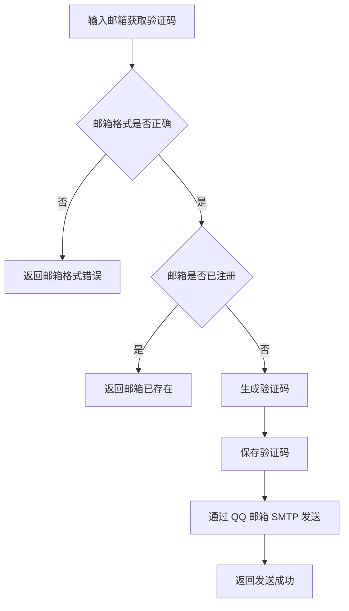

## 2. 用户注册

触发：

用户填写用户名、邮箱、邮箱验证码、密码、昵称后点击注册。

前置条件：

- 用户名未被注册
- 邮箱未被注册
- 昵称未被使用
- 邮箱验证码正确
- 邮箱验证码未过期
- 邮箱验证码未使用
- 用户名 4-20 位，只能包含字母、数字、下划线
- 密码 6-20 位
- 昵称 1-8 位
- 头像 URL 不为空

后端逻辑：

1. 校验请求参数
2. 查询用户名是否已存在
3. 查询邮箱是否已存在
4. trim 昵称
5. 查询昵称是否已存在
6. 校验头像 URL 不为空
7. 校验 `purpose = register` 的邮箱验证码
8. 使用 `bcrypt` 对密码进行哈希处理
9. 创建用户
10. 标记邮箱验证码已使用
11. 生成 JWT
12. 返回用户信息和 token

数据变化：

- 新增 `users` 记录

返回结果：

- 用户信息
- JWT token，有效期 7 天

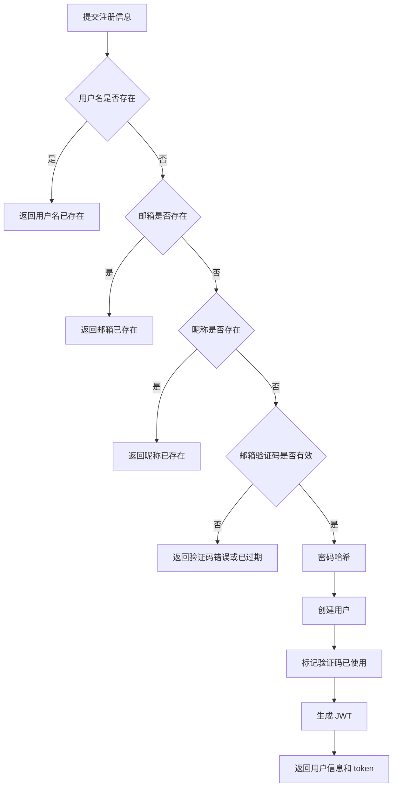

## 3. 用户登录

触发：

用户填写用户名、密码后点击登录。

前置条件：

- 用户名已注册
- 密码正确

后端逻辑：

1. 校验请求参数
2. 根据用户名查询用户
3. 校验密码
4. 生成 JWT
5. 返回用户信息和 token

数据变化：

- 第一版不记录登录日志

返回结果：

- 用户信息
- JWT token，有效期 7 天

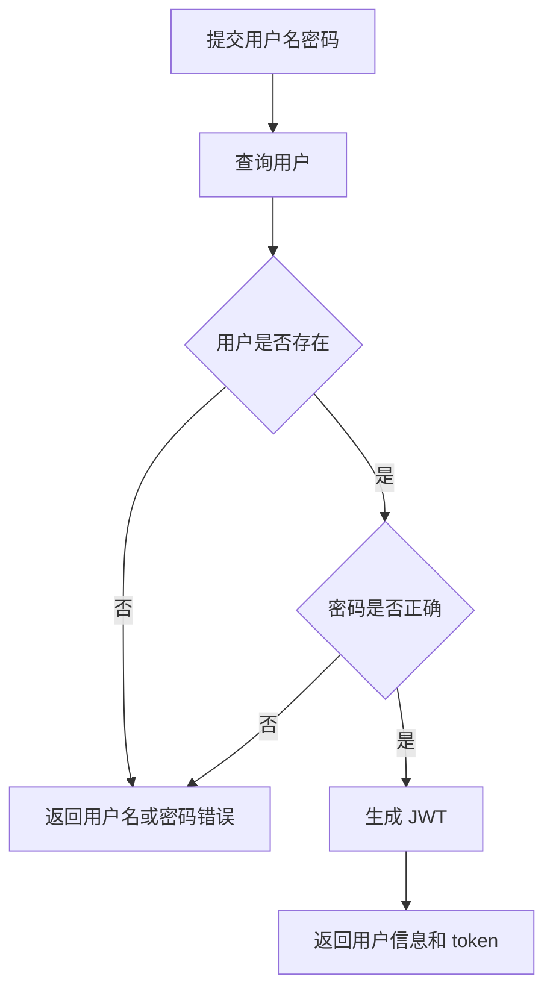

## 4. 发送重置密码验证码

触发：

用户忘记密码，输入邮箱后点击获取验证码。

前置条件：

- 邮箱已绑定用户
- 同一邮箱 60 秒内没有发送过验证码
- 同一邮箱 1 小时内发送验证码不超过 5 次

后端逻辑：

1. 校验邮箱格式
2. 查询邮箱对应的用户
3. 校验发送频率
4. 将同一邮箱同一用途的旧验证码置为失效
5. 生成 6 位数字验证码
6. 写入 `email_verification_codes`，`purpose = reset_password`
7. 通过 QQ 邮箱 SMTP 发送验证码
8. 返回发送成功

数据变化：

- 新增 `email_verification_codes` 记录

失败处理：

- 邮箱发送失败时，接口返回 `500`

返回结果：

- 发送成功

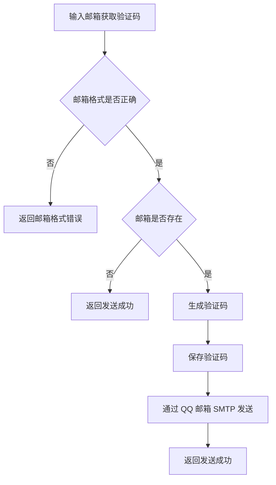

说明：

- 即使邮箱不存在，也返回发送成功，避免暴露哪些邮箱注册过
- QQ 邮箱 SMTP 使用授权码，不使用 QQ 登录密码

## 5. 重置密码

触发：

用户收到邮箱验证码后，输入验证码和新密码。

前置条件：

- 邮箱已绑定用户
- 验证码存在
- 验证码未过期
- 验证码未使用
- 新密码符合最小长度要求

后端逻辑：

1. 校验邮箱、验证码、新密码
2. 查询邮箱对应用户
3. 查询最新一条 `purpose = reset_password`、未使用且未过期的验证码
4. 校验验证码是否匹配
5. 使用 `bcrypt` 对新密码进行哈希处理
6. 更新用户密码
7. 标记验证码已使用
8. 返回重置成功

数据变化：

- 更新 `users.password_hash`
- 更新 `email_verification_codes.used_at`

返回结果：

- 重置成功

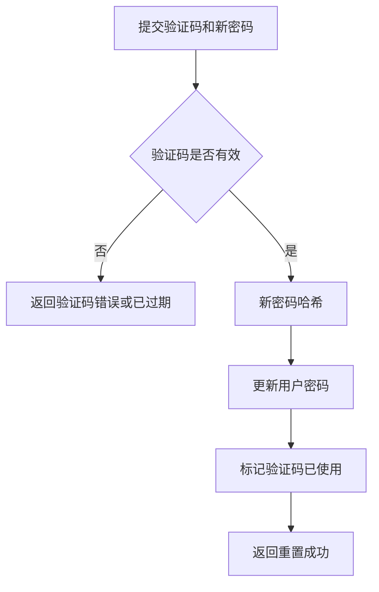

## 6. 更新用户信息

触发：

用户修改昵称。

前置条件：

- 用户已登录
- 昵称 1-8 位
- 昵称未被其他用户使用

后端逻辑：

1. 校验 JWT
2. trim 昵称
3. 校验昵称长度
4. 查询昵称是否已被其他用户使用
5. 更新用户昵称
6. 返回最新用户信息

数据变化：

- 更新 `users.nickname`

说明：

- 修改昵称时，昵称也不可与其他用户重复

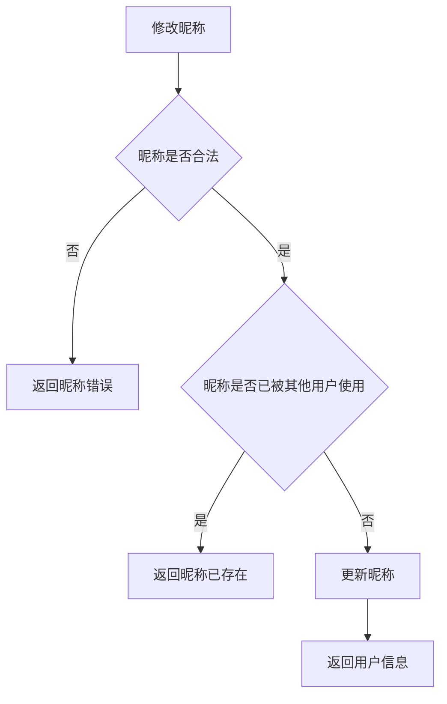

## 7. 上传头像

触发：

用户在个人资料页选择头像文件并上传。

前置条件：

- 用户已登录
- 文件是允许的图片类型
- 文件大小不超过后端限制

头像限制：

- 格式：jpg、jpeg、png、webp
- 大小：最大 2MB
- COS 路径：`avatars/{user_id}/{timestamp}.{ext}`
- 第一版公开读

后端逻辑：

1. 校验 JWT
2. 校验上传文件
3. 生成 COS 对象路径
4. 上传图片到腾讯云 COS
5. 获取图片访问 URL
6. 更新 `users.avatar_url`
7. 返回最新用户信息

失败处理：

- COS 上传失败时，接口返回 `500`

数据变化：

- 更新 `users.avatar_url`

返回结果：

- 用户信息

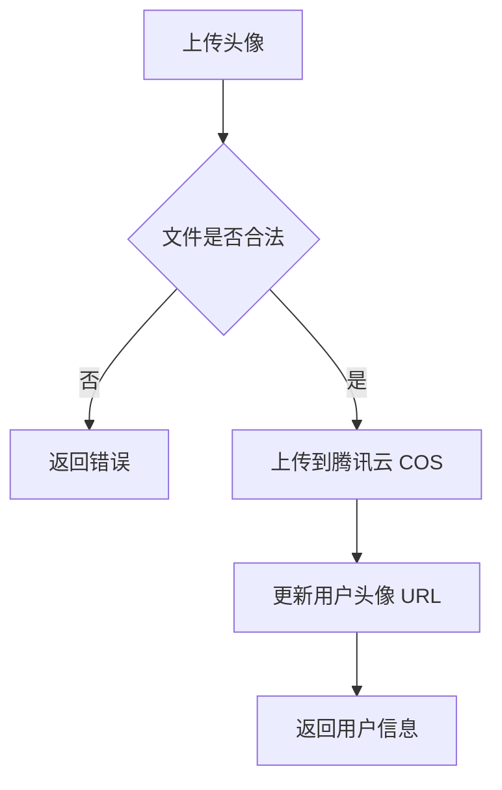

## 8. 创建房间

触发：

用户选择 2 人房间或 8 人房间后点击创建。

前置条件：

- 用户已登录
- 房间人数只能选择 2 人或 8 人
- 用户当前不在其他房间

后端逻辑：

1. 校验 JWT
2. 检查用户是否已经在其他房间
3. 校验 `max_members` 只能是 `2` 或 `8`
4. 使用当前用户昵称生成房间名称
5. 创建房间，当前用户为房主
6. 创建房间成员记录，当前用户为房主
7. 返回房间信息

数据变化：

- 新增 `rooms` 记录
- 新增 `room_members` 记录
- `rooms.owner_id = 当前用户 ID`
- `rooms.name = 用户昵称 + 的房间`
- `rooms.max_members = 2 或 8`
- `room_members.is_owner = 1`

WebSocket 广播：

- 无

说明：

- 2 人房包含房主
- 8 人房包含房主
- 创建房间只走 HTTP
- 创建成功后，前端再建立 WebSocket 连接
- 房间名称创建后固定，用户后续修改昵称不影响已创建房间名

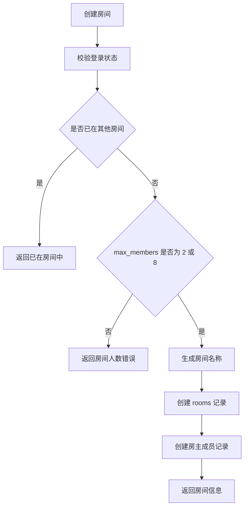

## 9. 进入房间

触发：

用户点击进入房间。

前置条件：

- 用户已登录
- 房间存在
- 房间人数未达到最大人数
- 用户当前不在其他房间

后端逻辑：

1. 校验 JWT
2. 开启数据库事务
3. 检查用户是否已经在其他房间
4. 查询房间是否存在
5. 查询房间当前成员人数
6. 如果成员人数已达到最大人数，拒绝进入
7. 创建房间成员记录
8. 提交事务
9. 返回房间信息和成员列表

数据变化：

- 新增 `room_members` 记录

并发规则：

- 进入房间必须在事务中完成人数检查和成员创建
- 数据库通过 `room_members.user_id` 唯一索引保证一个用户同一时间只能在一个房间

WebSocket 广播：

- `member.joined`

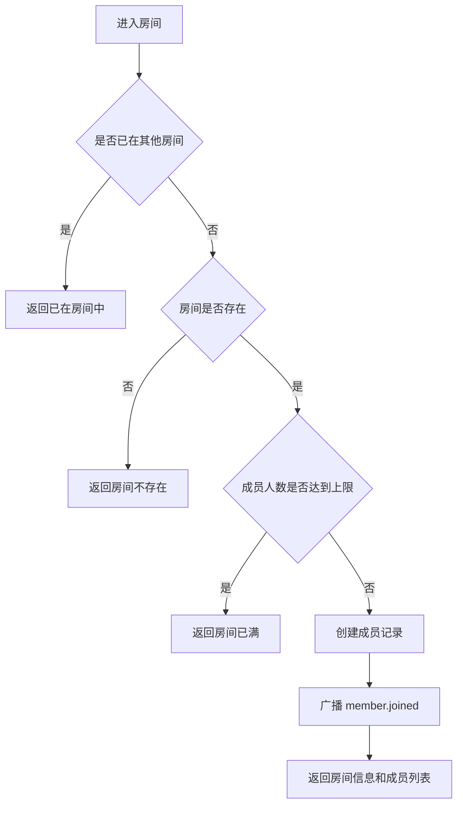

## 10. 离开房间

触发：

用户主动退出房间，或 WebSocket 断开后后端确认用户离开。

前置条件：

- 用户已登录
- 房间存在
- 用户在房间内，或用户已经不在房间内

后端逻辑：

1. 校验 JWT
2. 查询房间和成员记录
3. 如果用户已经不在房间中，直接返回成功
4. 删除当前用户的房间成员记录
5. 判断房间内是否还有其他成员
6. 如果没有其他成员，删除房间和房间消息
7. 如果还有其他成员，并且离开的用户不是房主，广播成员离开
8. 如果还有其他成员，并且离开的用户是房主，选择最早加入的成员为新房主
9. 广播相关事件

数据变化：

- 删除当前用户的 `room_members` 记录
- 如果房主变更，更新 `rooms.owner_id`
- 如果房主变更，更新新房主的 `room_members.is_owner`
- 如果房间没有其他成员，删除该房间的 `messages`
- 如果房间没有其他成员，删除该房间的 `rooms`

WebSocket 广播：

- `member.left`
- 必要时广播 `room.owner_changed`
- 如果房间被删除，不再额外广播房间删除事件

幂等规则：

- 用户不在房间时调用离开房间接口，也返回成功

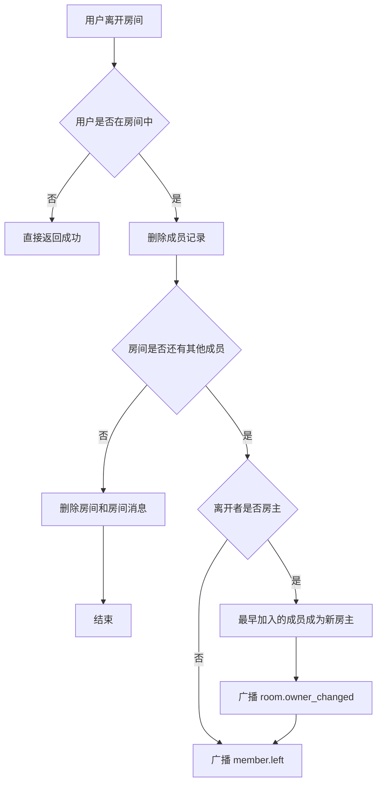

## 11. 房主自动转让

触发：

房主离开房间。

转让规则：

1. 只在房主离开时触发
2. 只从房间剩余成员中选择新房主
3. 优先选择 `joined_at` 最早的成员
4. 新房主的 `is_owner` 更新为 `1`
5. `rooms.owner_id` 更新为新房主 ID
6. 广播 `room.owner_changed`

特殊情况：

- 如果房间内没有其他成员，房间会被删除
- 进入房间时不处理房主转让，只判断是否已在其他房间、房间是否存在和人数是否达到上限

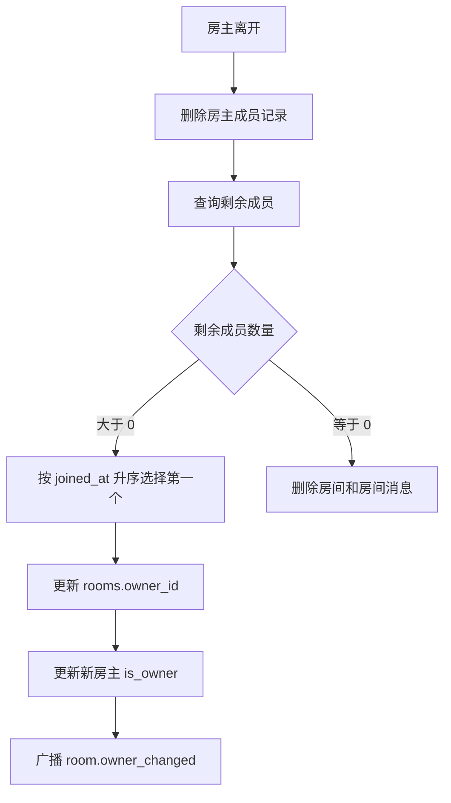

## 12. 发送文字消息

触发：

用户在房间内发送文字消息。

前置条件：

- 用户已登录
- 房间存在
- 用户是房间成员
- 消息内容不为空
- 消息内容最多 50 字

后端逻辑：

1. 校验 JWT
2. 查询房间是否存在
3. 查询当前用户是否为房间成员
4. trim 消息内容
5. 校验消息内容不为空且最多 50 字
6. 写入消息表
7. 广播消息创建事件
8. 返回消息信息

数据变化：

- 新增 `messages` 记录

WebSocket 广播：

- `message.created`

发送方式：

- 第一版消息通过 HTTP 接口发送
- WebSocket 只负责接收广播

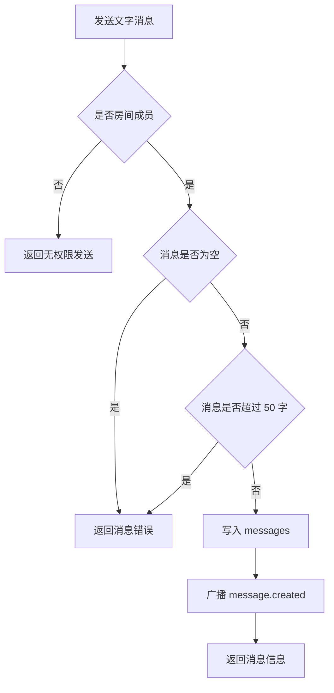

## 13. 获取历史消息

触发：

用户进入房间后加载历史消息，或向上翻页。

前置条件：

- 用户已登录
- 房间存在
- 用户是房间成员

后端逻辑：

1. 校验 JWT
2. 查询房间是否存在
3. 查询当前用户是否为房间成员
4. 按 `id` 倒序查询消息
5. 如果传入 `before_id`，只查询小于该 ID 的消息
6. 将查询结果按 `id` 正序返回

数据变化：

- 无

WebSocket 广播：

- 无

排序规则：

- 查询时按 `id` 倒序分页
- 返回给前端时按 `id` 正序展示

## 14. 开麦和闭麦

触发：

用户点击开麦或闭麦按钮。

前置条件：

- 用户已登录
- 房间存在
- 用户是房间成员

后端逻辑：

1. 校验 JWT
2. 查询当前用户是否为房间成员
3. 校验 `mic_status` 是否为 `on` 或 `off`
4. 更新成员麦克风状态
5. 广播麦克风状态变化
6. 返回最新成员状态

数据变化：

- `room_members.mic_status = on/off`

WebSocket 广播：

- `member.mic_updated`

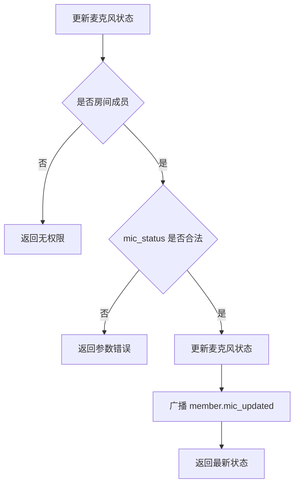

## 15. WebSocket 连接

触发：

用户进入房间页面后，前端建立 WebSocket 连接。

连接地址：

```txt
GET /ws/v1/rooms/:room_id?token=jwt_token
```

前置条件：

- token 有效
- 房间存在
- 用户已经进入房间

后端逻辑：

1. 校验 token
2. 查询房间是否存在
3. 查询用户是否为房间成员
4. 升级 HTTP 连接为 WebSocket
5. 将连接加入房间连接池
6. 监听客户端断开
7. 断开后移除连接

数据变化：

- 正常连接不直接修改数据库
- WebSocket 断开时执行离开房间流程
- 第一版不做断线等待期
- 心跳间隔 30 秒
- 超时时间 60 秒
- 心跳超时后断开连接并执行离开房间流程

WebSocket 广播：

- 正常连接成功不广播
- 离开房间时广播 `member.left`

鉴权失败：

- 不升级 WebSocket 连接
- 直接返回 `401`

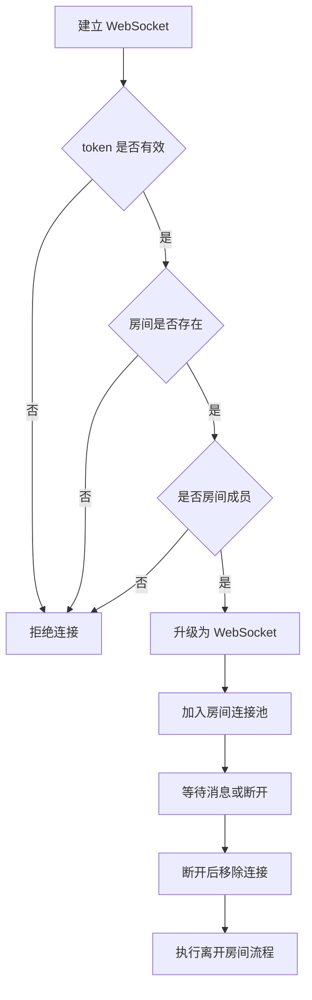

## 16. WebSocket 事件列表

### 16.1 member.joined

用户进入房间时广播。

```json
{
  "type": "member.joined",
  "room_id": 1,
  "data": {
    "user_id": 1,
    "nickname": "Alex",
    "avatar_url": ""
  }
}
```

### 16.2 member.left

用户离开房间时广播。

```json
{
  "type": "member.left",
  "room_id": 1,
  "data": {
    "user_id": 1
  }
}
```

### 16.3 room.owner_changed

房主变更时广播。

```json
{
  "type": "room.owner_changed",
  "room_id": 1,
  "data": {
    "owner_id": 2
  }
}
```

### 16.4 message.created

用户发送文字消息时广播。

```json
{
  "type": "message.created",
  "room_id": 1,
  "data": {
    "id": 10,
    "sender_id": 1,
    "content": "hello",
    "created_at": "2026-06-16T16:00:00+08:00"
  }
}
```

### 16.5 member.mic_updated

用户开麦或闭麦时广播。

```json
{
  "type": "member.mic_updated",
  "room_id": 1,
  "data": {
    "user_id": 1,
    "mic_status": "on"
  }
}
```
